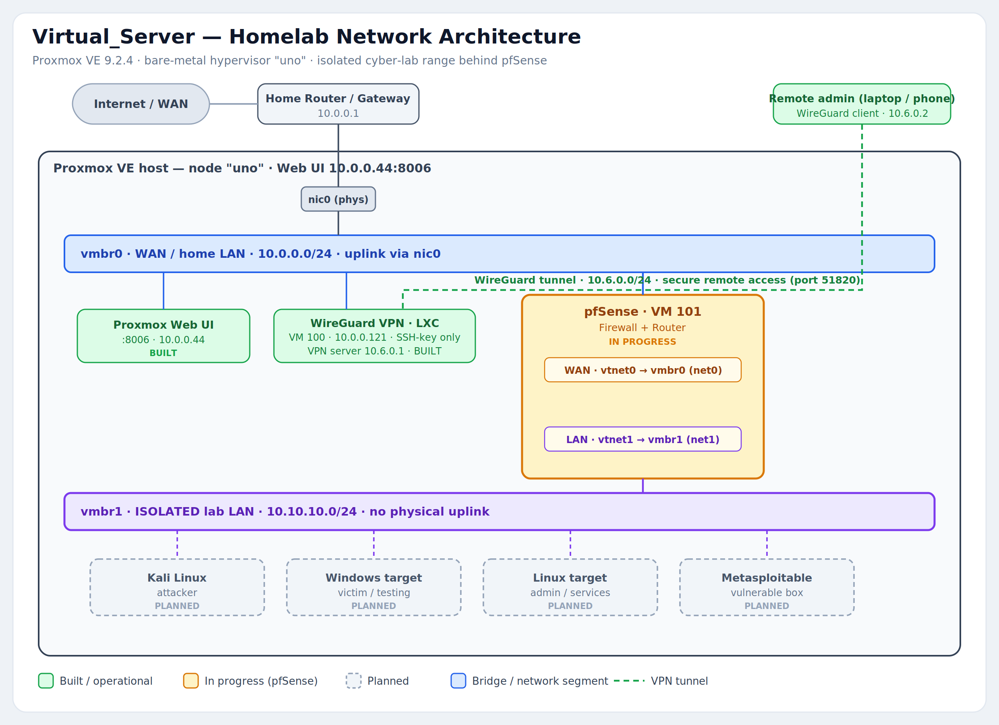
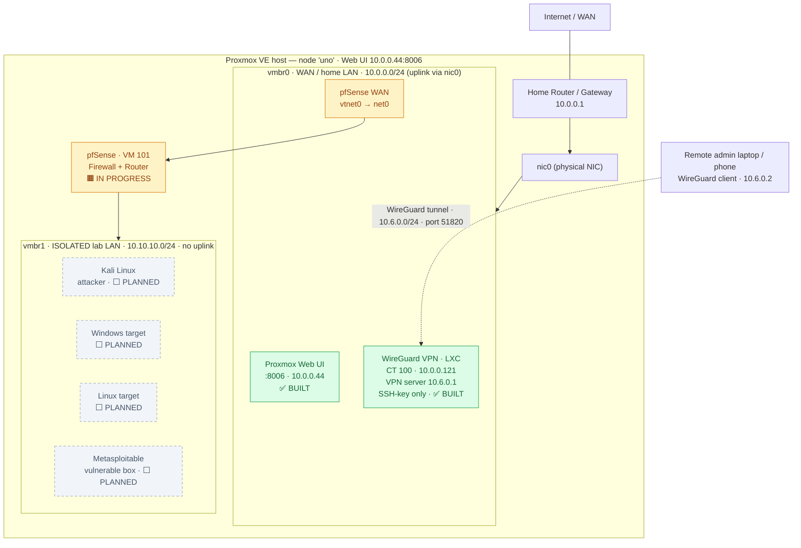

# Virtual_Server — A Cybersecurity Homelab


> Building a real, self-hosted cybersecurity lab from bare metal up — a hypervisor,
> secure remote access, a firewall, and an isolated network to safely break things in.

---

## What this is (in plain English)

I took one physical computer and turned it into a machine that runs many isolated
"pretend computers" (virtual machines). The goal is a **sealed-off practice arena**
for cybersecurity work — malware analysis, penetration testing, and vulnerable
target machines — that runs completely walled off from my real home network.

It's built in the order a real infrastructure engineer would build it:

1. **The host** — [Proxmox VE](proxmox/proxmox_setup.md) on dedicated hardware (node `uno`), so one box can run many machines.
2. **Secure remote access** — a [WireGuard VPN with SSH hardening](wireguard/wireguard_setup.md), so I can administer the lab from anywhere without ever exposing the management interface to the internet.
3. **The gatekeeper** — a [pfSense firewall](pfsense/pfsense_setup.md) with two network cards: one on my home network, one on a private isolated bridge. This is what keeps the lab from ever touching the rest of the house.
4. **The lab** *(next)* — attacker and victim machines living behind the firewall, on a network that can reach the internet but **cannot** reach my home LAN.

Feel free to use this repo as a guide for your own setups.

---

## Network architecture



Legend: 🟩 **built** · 🟧 **in progress** · ⬜ **planned**. A vector version lives at
[`docs/img/network_architecture.svg`](docs/img/network_architecture.svg).

<details>
<summary><b>Mermaid version</b> (renders natively on GitHub — click to expand)</summary>


</details>

> [!NOTE]
> The isolated lab subnet `10.10.10.0/24` is a **placeholder** I'm standing up — pick
> any private range that does not overlap your home LAN. See the [pfSense writeup](pfsense/pfsense_setup.md)
> for why reusing your home subnet causes routing conflicts.

---

## Table of contents

| Project | What it covers | Status |
| --- | --- | --- |
| **[Proxmox VE setup](proxmox/proxmox_setup.md)** | Installing the bare-metal hypervisor, first boot, fixing a subnet mismatch, uploading ISOs, post-install tuning | ✅ Built |
| **[WireGuard VPN + SSH hardening](wireguard/wireguard_setup.md)** | Secure remote admin: WireGuard tunnel, SSH key-only auth, and two real bugs I hit and fixed | ✅ Built |
| **[pfSense firewall + isolated lab](pfsense/pfsense_setup.md)** | A virtual firewall with a WAN + an isolated LAN bridge (`vmbr1`) to wall the lab off from home | 🚧 In progress |
| [Security model](SECURITY.md) | How keys are handled and how the isolation boundary works | — |
| [Roadmap](ROADMAP.md) | Where this is headed next | — |

**This isn't just docs — the build is reproducible:**

| Resource | What it does |
| --- | --- |
| **[`scripts/`](scripts/)** | Create the isolated `vmbr1` bridge; generate WireGuard client profiles — dry-run by default |
| **[Infrastructure-as-Code](infra/README.md)** | Terraform (`bpg/proxmox`) to create the lab VMs + Ansible to baseline them |
| **[Hands-on lab guide](docs/lab-guide.md)** | A beginner-followable first attacker-vs-target exercise on the isolated range |
| **[`Makefile`](Makefile)** | One entrypoint (`make help`) tying the stages together |

---

## Skills demonstrated

Everything here is grounded in what's actually built in this repo:

- **Bare-metal virtualization** — deployed Proxmox VE 9.2.4 on dedicated hardware (node `uno`), including BIOS boot-order changes and post-install repository tuning.
- **Linux bridge networking & segmentation** — designed a two-bridge layout: `vmbr0` (uplink to the home LAN) and an intentionally **isolated** `vmbr1` (no IP, no physical port) as the lab network.
- **VPN deployment** — stood up a WireGuard tunnel (`10.6.0.0/24`) for remote administration over port `51820`.
- **SSH hardening** — key-only authentication (`ed25519`), `PermitRootLogin prohibit-password`, password auth disabled — management is never exposed directly to the internet.
- **Firewall / router deployment** — built a pfSense VM with separate WAN and LAN interfaces to route and firewall the lab.
- **Network troubleshooting & root-cause analysis** — diagnosed and fixed a VPN subnet collision with the home LAN and a bad client endpoint (documented in the [WireGuard writeup](wireguard/wireguard_setup.md#troubleshooting-and-war-stories)).
- **Secure-by-design thinking** — the whole architecture is organized around a clear trust boundary (see [SECURITY.md](SECURITY.md)).
- **Infrastructure-as-Code & automation** — Terraform (`bpg/proxmox`) and Ansible to reproduce the lab from code, plus idempotent, dry-run-first shell scripts (see [`infra/`](infra/README.md) and [`scripts/`](scripts/)).
- **Technical documentation** — reproducible, screenshot-backed writeups for each stage.

---

## Status & roadmap

| # | Milestone | Status | Notes |
| --- | --- | --- | --- |
| 1 | Proxmox VE host on bare metal (node `uno`) | ✅ Done | VE 9.2.4, web UI at `10.0.0.44:8006` |
| 2 | WireGuard VPN + SSH hardening (CT 100) | ✅ Done | VPN `10.6.0.0/24`, key-only SSH |
| 3 | Isolated bridge `vmbr1` on Proxmox | ✅ Done | No IP / no uplink — confirmed in screenshots |
| 4 | pfSense VM built (2 NICs, UEFI) | ✅ Done | VM 101; `net0`→`vmbr0`, `net1`→`vmbr1` |
| 5 | pfSense installed & configured (WAN/LAN, DHCP, rules) | 🚧 In progress | VM boots to installer; config is the standard path |
| 6 | First lab targets on `vmbr1` (Kali + vulnerable box) | ⬜ Planned | See the lab guide (coming) |
| 7 | Route WireGuard into the pfSense lab | ⬜ Planned | Fuses remote access + isolated range into one |
| 8 | VLAN-segment the lab (attacker vs victim nets) | ⬜ Planned | |
| 9 | Automate the build (scripts + Terraform + Ansible) | 🚧 Scaffolding written | Code lives in [`scripts/`](scripts/) + [`infra/`](infra/README.md); reviewed but **not yet run** against the live host |

---

## Repository structure

```text
Virtual_Server/
├── README.md                  ← you are here
├── SECURITY.md                ← key handling + isolation model
├── ROADMAP.md                 ← what's next
├── CHANGELOG.md               ← history of changes
├── Makefile                   ← `make help` — one entrypoint for the stages
├── proxmox/                   ← ✅ hypervisor install walkthrough
│   ├── proxmox_setup.md
│   └── img/
├── wireguard/                 ← ✅ VPN + SSH hardening
│   └── wireguard_setup.md
├── pfsense/                   ← 🚧 firewall + isolated lab network
│   ├── pfsense_setup.md
│   └── img/
├── scripts/                   ← create-vmbr1 + wg-client-gen (dry-run first)
├── infra/                     ← Infrastructure-as-Code
│   ├── terraform/             ←   lab VMs on vmbr1 (bpg/proxmox)
│   └── ansible/               ←   baseline + isolation assertion
├── configs/                   ← sanitized config templates (*.example)
└── docs/
    ├── lab-guide.md           ← hands-on attacker-vs-target exercise
    ├── img/network_architecture.{png,svg}
    └── network_architecture.mmd
```

---

## A note on how this repo is documented

Each writeup follows the same shape so it's easy to skim:
**Overview → Objective → Network architecture → Steps → Verification → Useful commands → Outcome.**
Where a value is a sensible default rather than something I've locked in, it's flagged
as a placeholder to confirm — nothing here claims to be tested or configured when it wasn't.
