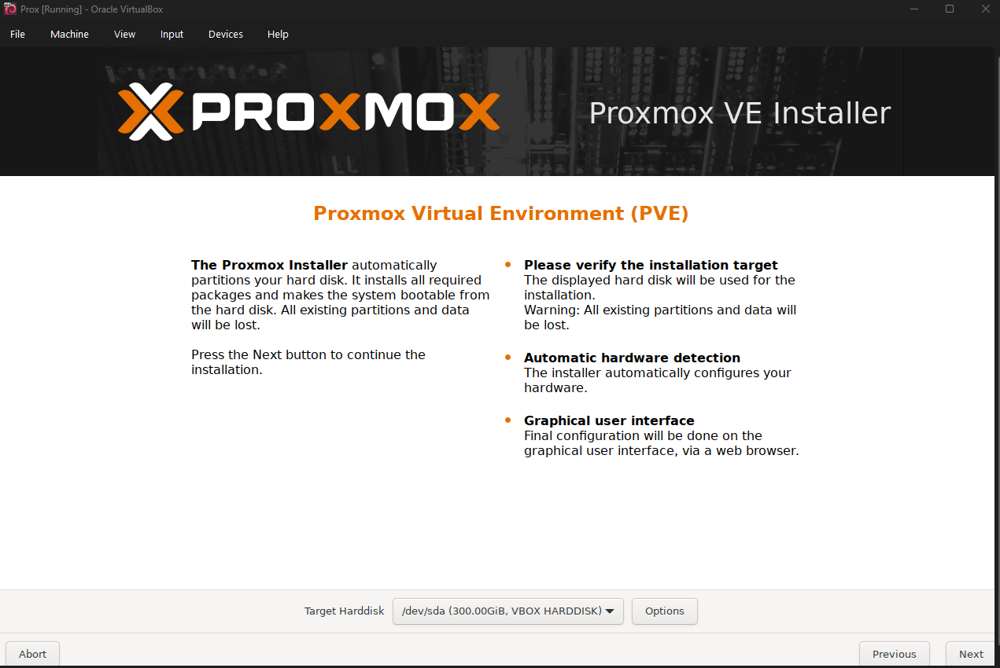
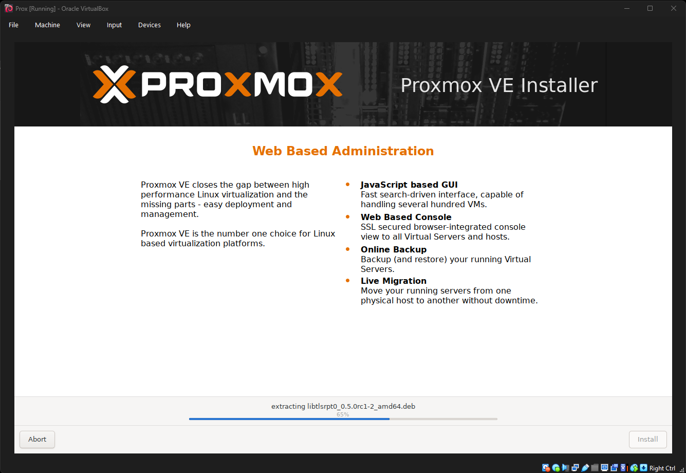
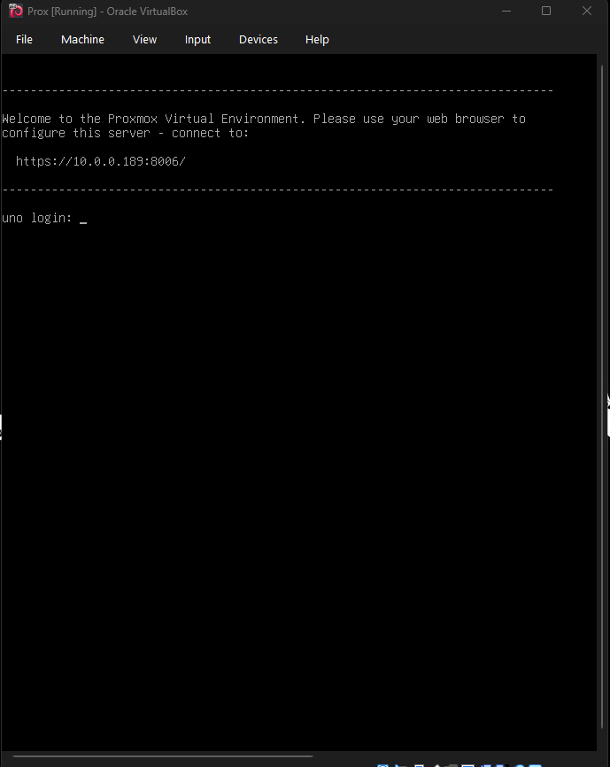
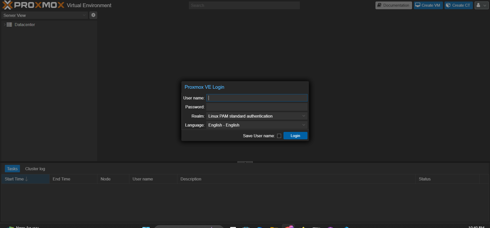
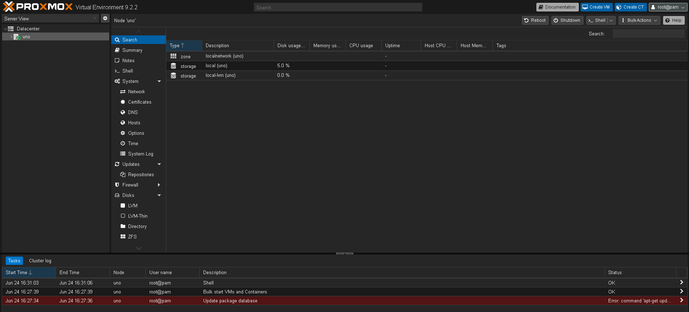
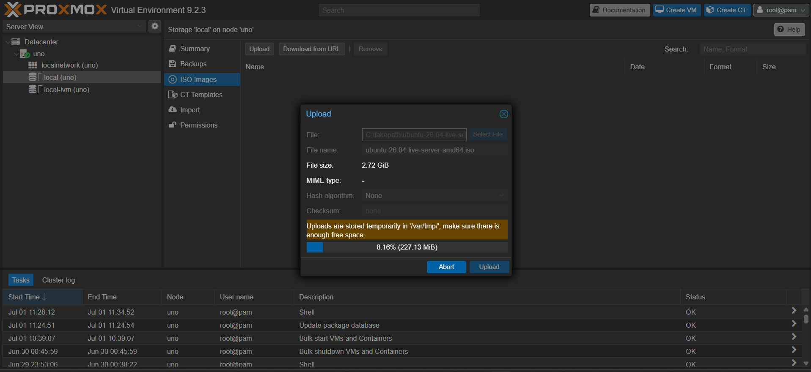
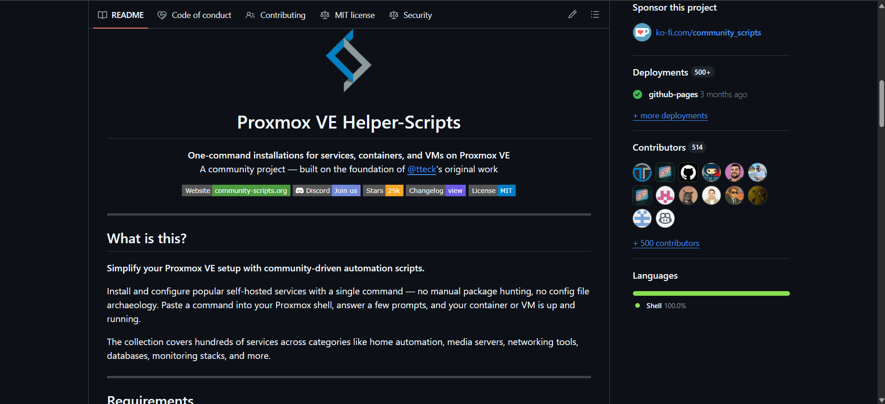
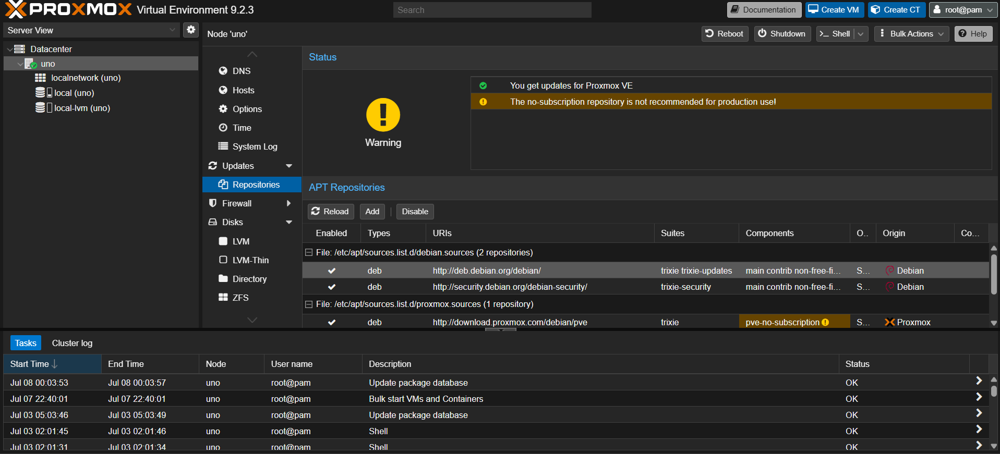
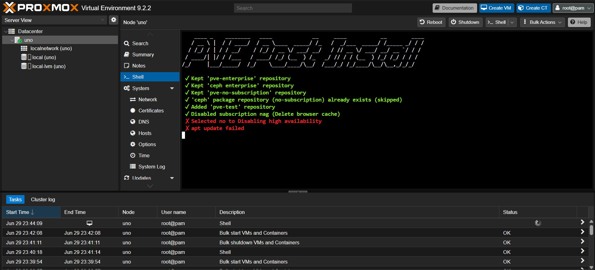

<sub>[← Back to README](../README.md) · Related: [WireGuard VPN](../wireguard/wireguard_setup.md) · [pfSense firewall](../pfsense/pfsense_setup.md)</sub>

# Introduction to Proxmox — Walkthrough

## Overview

[Proxmox](https://www.proxmox.com/en/downloads) is an open-source virtualization platform that provides several server solutions, including:

- Proxmox VE
- Proxmox Backup Server
- Proxmox Mail Gateway
- Proxmox Datacenter Manager

For this homelab, I installed **Proxmox VE** — the virtualization engine that lets one physical machine host all of the lab's virtual machines and containers. Feel free to use this repo as a guide for your own setups.

> [!NOTE]
> The screenshots in this walkthrough were captured across the build as I kept the
> server updated, so you'll see versions from **VE 9.2.2 through 9.2.4**. The current
> host runs **9.2.4**. Screenshots with an "Oracle VirtualBox" title bar are from a
> throwaway VM I used to demonstrate the installer safely — the real server runs on
> dedicated hardware.

## Objective

- Install Proxmox VE on dedicated (bare-metal) hardware
- Reach the Proxmox web interface from another device on the network
- Correct the host's network configuration if it lands on the wrong subnet
- Prepare local ISO storage so VMs can be created later

## Network Architecture

| Device | Address | Notes |
| --- | --- | --- |
| Home router (gateway) | 10.0.0.1 | |
| Proxmox host (node `uno`) | 10.0.0.44/24 | Web UI at `https://10.0.0.44:8006` |

## Project Workflow

### 1. Create the Installation USB

Before installing Proxmox, the ISO must be written to a bootable USB drive. Two common tools are:

- [Rufus](https://rufus.ie/en/)
- [Ventoy](https://www.ventoy.net/en/index.html)

**Recommendation:** I personally recommend **Ventoy**, because it lets multiple bootable ISO files live on a single USB drive. Instead of reformatting the drive every time you need another operating system, you simply copy additional ISO files onto the USB.

### 2. Install Proxmox VE

For demonstration purposes, I first installed Proxmox inside an [Oracle VirtualBox](https://www.virtualbox.org/) virtual machine. If you're just getting started and don't want to dedicate a hard drive or SSD to Proxmox, this is a viable way to boot the ISO and learn the installer safely. As shown in [Example 1.1](#example-1-1), I created a virtual machine with a **300 GB** virtual disk to demonstrate what the install screen should look like. The installer running is shown in [Example 1.2](#example-1-2).

The server I actually use is installed directly on its own dedicated hard drive. Installing Proxmox on real hardware means going into the device's **BIOS** and changing the boot priority so the USB with the Proxmox installer takes **first priority** at startup. If this step is skipped, the installer never starts.

> [!WARNING]
> When installing Proxmox, make sure you select the correct destination for the install. Proxmox will **erase all data** on the selected location.

During the install, Proxmox asks you to create a password for the `root` account. Remember it — that's how you log into both the server console and the web page. The default account is named `root` (you can add others later). The installer also asks for a hostname (Proxmox calls this the FQDN); for my example I set mine to **`uno`**, which becomes the node name you'll see everywhere in the UI.

<h4 id="example-1-1">Example 1.1 — Proxmox Installation Agreement</h4>


<h4 id="example-1-2">Example 1.2 — Proxmox Installer Running</h4>


### 3. First Boot and Reaching the Web Interface

Proxmox has no desktop GUI on the machine it's installed on — it boots straight to a terminal. At the login prompt, type the username `root`, press Enter, and enter the password you set during installation. If everything was configured correctly, you now have command-line access to the system.

The console also prints the address of the web interface, in the form `https://<your-ip>:8006/`, where **8006** is the default TCP port Proxmox serves its UI on. [Example 1.3](#example-1-3) shows the first-boot terminal (here the demo VM reports `https://10.0.0.189:8006/`; the real server is at `10.0.0.44`). Browse to that address from another device and you'll reach the login page in [Example 1.4](#example-1-4); after logging in you land on the dashboard in [Example 1.5](#example-1-5).

<h4 id="example-1-3">Example 1.3 — First Boot Terminal</h4>


<h4 id="example-1-4">Example 1.4 — Web Interface Login</h4>


<h4 id="example-1-5">Example 1.5 — Proxmox Web Dashboard</h4>


> [!WARNING]
> Your Proxmox server and the device you connect from must be on the **same network and subnet**, or the browser won't reach the web interface. To find the subnet/IP your device is using:
> - Windows: `ipconfig`
> - Linux: `ip -a`
> - Mac: `curl ifconfig.me`

### 4. Fix a Subnet Mismatch (if needed)

If your Proxmox server ends up on a different subnet than the rest of your network, you'll need to update its network configuration before you can reach it. For example:

```text
Your computer:   192.168.0.32
Proxmox server:  172.16.0.10
```

These devices are on different subnets, so they can't communicate without additional routing. The simplest fix is to move Proxmox onto your network's subnet. Open the Proxmox terminal and edit the network configuration file:

```bash
nano /etc/network/interfaces
```

Locate the `address` and `gateway` lines. Before changing them, find an unused IP on your network — from another device, run:

```bash
arp -a
```

Choose an unused address in your network's subnet, then update both fields. Save the file and reboot (or restart networking) to apply. The result should look like:

```text
Your computer:   192.168.0.32
Proxmox server:  192.168.0.<unused>
Gateway:         192.168.0.1   # the router's IP, usually .1
```

### 5. Upload ISO Images

Uploading ISO images is straightforward. Navigate to the ISO Images section under your local storage:

```text
local (node name)
└── ISO Images
    └── Upload
```

Proxmox gives you two ways to add ISO images:

- **Upload from your local device** — select an ISO stored on your computer.
- **Download from a URL** — provide a direct download link and Proxmox retrieves it for you.

Both are shown in [Example 1.6](#example-1-6). *(This is the same storage the [pfSense installer ISO](../pfsense/pfsense_setup.md#2-create-the-pfsense-vm) is uploaded to.)*

<h4 id="example-1-6">Example 1.6 — Uploading an ISO</h4>


### 6. Post-Install Tuning with the Helper-Scripts

One resource worth mentioning is [Proxmox VE Helper-Scripts](https://github.com/community-scripts/ProxmoxVE) — a community-driven project of automated scripts for setting up and customizing Proxmox ([Example 1.7](#example-1-7)).

<h4 id="example-1-7">Example 1.7 — Proxmox VE Helper-Scripts</h4>


A good example from that project is the **PVE Post Install** script, which automates the tuning a homelab typically wants:

- Enabling the no-subscription repository
- Disabling the enterprise repository (if you aren't paying for a subscription)
- Updating the package list
- Upgrading the system
- Disabling the "No valid subscription" popup

When you first add the no-subscription repository, Proxmox shows the warning in [Example 1.8](#example-1-8) — that's expected on a homelab and is exactly what the post-install script helps manage. [Example 1.9](#example-1-9) shows the script itself running.

<h4 id="example-1-8">Example 1.8 — No-Subscription Repository Warning</h4>


<h4 id="example-1-9">Example 1.9 — Running the PVE Post Install Script</h4>


## Verification

- The server boots to a console login and accepts the `root` password.
- The web interface is reachable at `https://<host-ip>:8006` from another device **on the same subnet**.
- Local storage (`local`, `local-lvm`) is visible in the dashboard, and ISO images can be uploaded — ready for creating VMs.

## Useful Commands

```bash
# On the client — find your subnet/IP
ipconfig                     # Windows
ip -a                        # Linux
curl ifconfig.me             # Mac

# On the Proxmox host — inspect / fix networking
arp -a                       # list addresses already in use on the LAN
nano /etc/network/interfaces # edit the host's address and gateway
```

## Outcome

Installed Proxmox VE on dedicated hardware (node `uno`), confirmed access to both the console and the web interface at `https://10.0.0.44:8006`, corrected the host networking so it sits on the home subnet, and prepared local ISO storage. The host is now ready to run the rest of the homelab — starting with the [WireGuard VPN](../wireguard/wireguard_setup.md) for secure remote access and the [pfSense firewall](../pfsense/pfsense_setup.md) for the isolated lab network.
